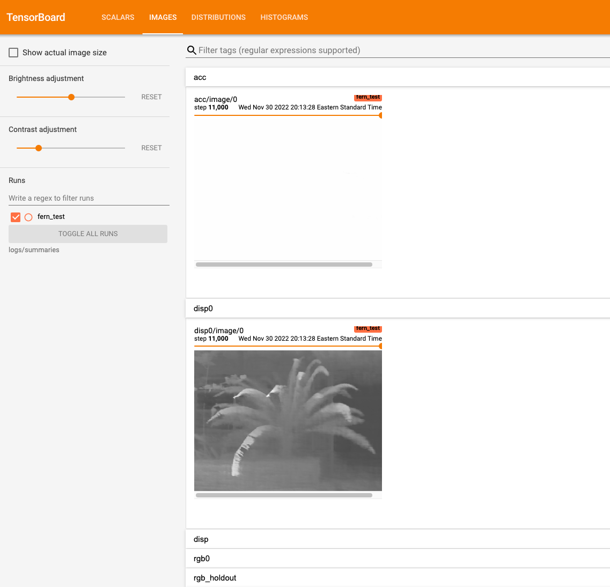

# Neural Radiance Fields (NeRF)
### About
Neural Radiance Fields (NeRF) takes in sequence of input images and optimizes a 
volumetric scene to synthesize novel views. This is achieved by using a neural 
network that encodes a continuous and volumetric representation of the scene.

A scene is represented as a continuous 5D function that outputs the radiance emitted in 
each direction $(\theta, \phi)$ at each point $(x, y, z)$ in space, and a density at 
each point which acts like a differential opacity controlling how much radiance is 
accumulated by a ray passing through $(x, y, z)$.

_NeRF Model Code found [here](https://github.com/bmild/nerf)._

### Success
Using Ubuntu 22.04 with NVDIA/Drivers I was able to have a successful training of 
the [Fern dataset](https://drive.google.com/drive/folders/1McCFABesPQxXDimpudJHd7xw-0IlWSba).

For this project, the setup was straight forward and the documentation on the NeRF model code 
executed as expected. I was able to use the `environment.yml` file to create my conda environment
and from there run all the required commands for training and evaluation.

## Tensorboard Training Progress:


**NOTE**: As I was accessing a remote Ubuntu machine I had to do the following to see the tensorboard status:
``` 
ssh -L 9999:localhost:8848 -N <Ubuntu-Machine>
```

### Failures
##### Limitation 1: NeRF on Apple M1
Apple Error:
```shell
..../MPSGraph.mm:673: failed assertion 'Placeholder shape mismatches (expected 1024 vs got tensorData with 32768) at dimIdx = 0'
```


### Citations
```
@misc{https://doi.org/10.48550/arxiv.2003.08934,
  doi = {10.48550/ARXIV.2003.08934},
  url = {https://arxiv.org/abs/2003.08934},
  author = {Mildenhall, Ben and Srinivasan, Pratul P. and Tancik, Matthew and Barron, Jonathan T. and Ramamoorthi, Ravi and Ng, Ren},
  keywords = {Computer Vision and Pattern Recognition (cs.CV), Graphics (cs.GR), FOS: Computer and information sciences, FOS: Computer and information sciences},
  title = {NeRF: Representing Scenes as Neural Radiance Fields for View Synthesis},
  publisher = {arXiv},
  year = {2020},
  copyright = {arXiv.org perpetual, non-exclusive license}
}
```