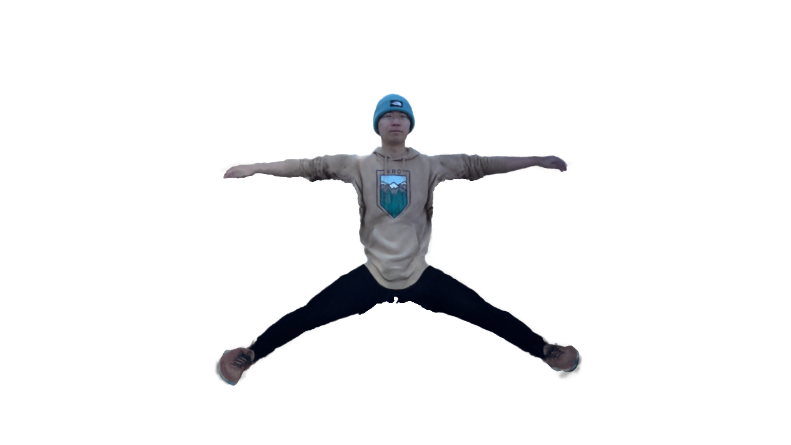
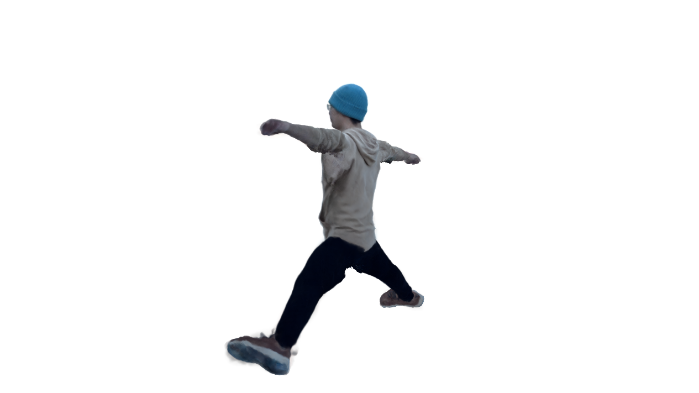
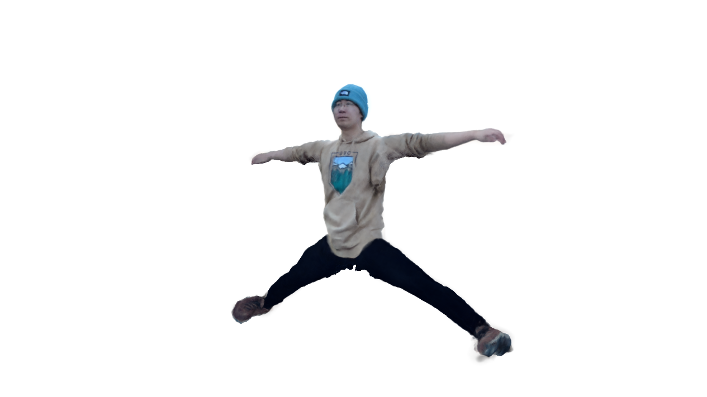

# NeuMan

### About

Neural Human Radiance Field from a Single Video (NeuMan) builds high quality renderings of 
human under novel poses and its environment from just a single video instead of just static images.
NeuMan combines and trains two NeRF models (a human NeRF model and a scene NeRF model). [NeuMan2022]
With training videos as short as 10 seconds this model can generate high quality renderings of
the human under novel poses and across different novel views composed together. 

_NeuMan Github Project found [here](https://github.com/apple/ml-neuman)._

### Successes
#### Google Colab
To minimize cost, I have managed to get a working prototype on Google Colab. This comes with
a slight boost to the GPU which there are varying [plans](https://colab.research.google.com/signup) for. With that, a couple of preprocessing
steps were required for setup and training. You can find full details of the notebook in [Apple_ML_Neuman-Colab.ipynb](results/neuman/Apple_ML_Neuman-Colab.ipynb)

#### Overview of Notebook:
For this project I pulled in the [ml-neuman repo](https://github.com/apple/ml-neuman.git) and mounted
it to my gdrive. In terms of environment, I was able to createa [conda](https://docs.conda.io/projects/conda/en/latest/index.html)
environment where I pulled in all required dependencies. With Colab, there is the `condacolab` library which makes integration 
with colab seamless.

_NOTE: As mentioned in the repo I needed to also download [SMPL](https://smpl.is.tue.mpg.de/index.html) weights and store them in the project. ML-Neuman leverages 
this to extract the basic human model. SMPL is a realistic 3D model of the human body that is based on skinning and blend shapes and is learned from thousands /
of 3D body scans. [SMPL2015] Resulting weights were manually stored in my repo and not shown in the notebook example._

Given the success of installation I was able to train on one of the [datasets](https://docs-assets.developer.apple.com/ml-research/datasets/neuman/dataset.zip) 
provided (specifically the Bike video). The goals of the training here was to pull out the human 
in the scene. The command below renders 360 views of a canonical human:
`!python render_360.py --scene_dir ./data/bike --weights_path ./out/bike_human/checkpoint.pth.tar --mode canonical_360`

### Results
Below are the extracted human from the scene that I trained.

<p float="left">
    
    
    
<p/>

### Failures
#### Limitations on Apple m1
- Required dependencies not supported on machine (cudatoolkit, nvidiacub, pytorch3d)
- Unable to leverage m1 GPU
#### Limitation on Windows
- Unable to download `environment.yml` on a Windows machine due to library clashes.

#### Looking Forward
As this is one of the models I was able to get working it would fit well into the overall System Project.
This would simply be a new model that needs to have preprocessing, training, and rendering done as I have
shown in the System Project. The main difference here is that we're expecting a single video and for that
video to contain 1 human in it. For that, we may need custom logic to be able to preprocess and separate out
the two (human and scene). With NeuMan we also have the ability to have "telegathering" which is rendering
reposed humans together with the scene.

### Citations
```
@misc{NeuMan2022,
    title = {NeuMan: Neural Human Radiance Field from a Single Video},
    author = {Wei Jiang and Kwang Moo Yi and Golnoosh Samei and Oncel Tuzel and Anurag Ranjan},
    year = {2022},
    URL = {https://arxiv.org/abs/2203.12575}
}
@inproceedings{jiang2022neuman,
  title={NeuMan: Neural Human Radiance Field from a Single Video},
  author={Jiang, Wei and Yi, Kwang Moo and Samei, Golnoosh and Tuzel, Oncel and Ranjan, Anurag},
  booktitle={Proceedings of the European conference on computer vision (ECCV)},
  year={2022}
}

@article{SMPL2015,
  author = {Loper, Matthew and Mahmood, Naureen and Romero, Javier and Pons-Moll, Gerard and Black, Michael J.},
  title = {{SMPL}: A Skinned Multi-Person Linear Model},
  journal = {ACM Trans. Graphics (Proc. SIGGRAPH Asia)},
  month = oct,
  number = {6},
  pages = {248:1--248:16},
  publisher = {ACM},
  volume = {34},
  year = {2015}
}
```