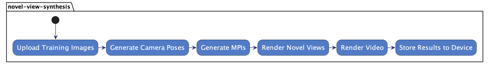
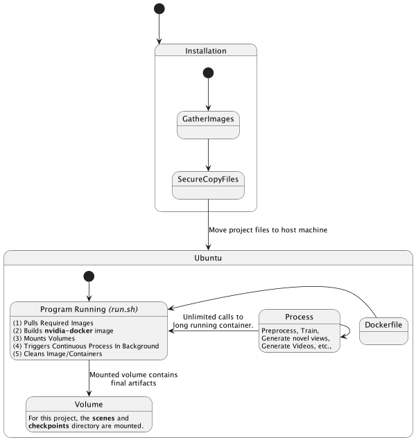
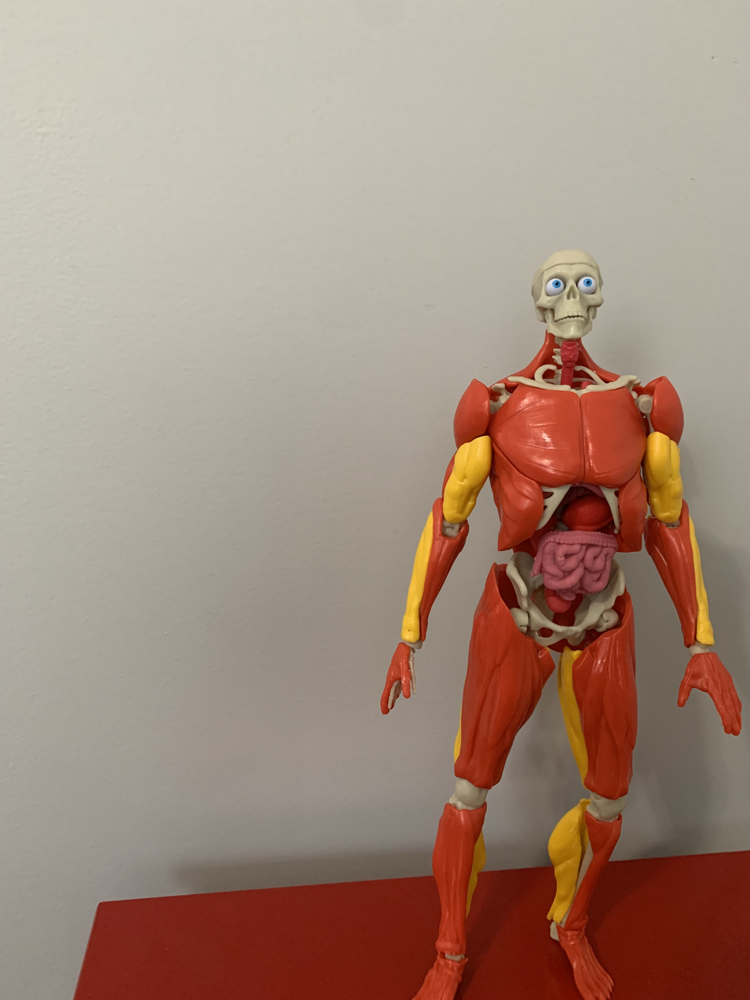
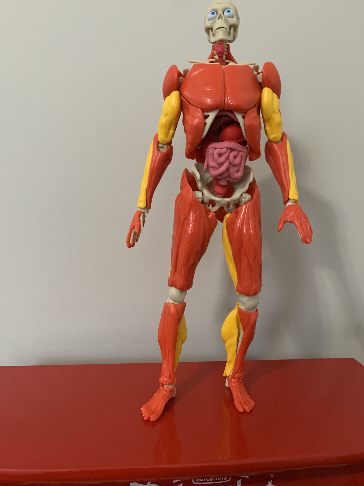
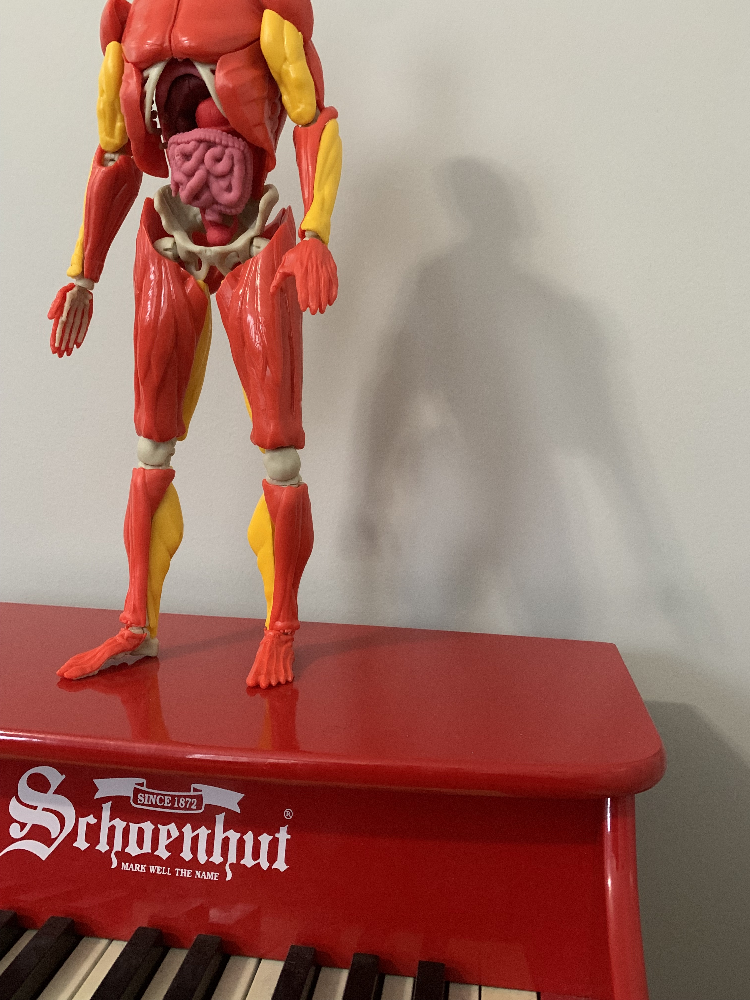
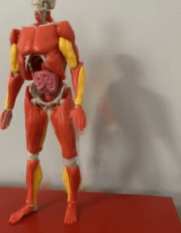

# DEMO: Novel View Synthesis with LLFF
### Important Notes For Teacher
- As I am using `nvidia-docker` for this project in a remote environment I was unable to push my docker image to docker hub. The `run.sh` discussed below will handle the creation of the image and running the project.
- This will not run on a Mac M1 or Windows machine currently.
- I did not require python code to implement my project--instead, I have used Docker commands with a few bash scripts to handle the logic (see diagrams below for implementation details).

In order to follow along with this project you must have the following:
### Requirements
- Ubuntu 22.04 +
- [Docker](https://docs.docker.com/engine/install/ubuntu/) installed.
- [NVIDIA](https://www.nvidia.com/download/index.aspx) installed with drivers. 

### My Environment
**Operating System Details**
* Distributor ID: Ubuntu
* Description: Ubuntu 22.04.1 LTS
* Release: 22.04
* Codename: jammy

**GPU Details**
```
$ ~/developer/projects/ lspci | grep -i nvidia
01:00.0 VGA compatible controller: NVIDIA Corporation GP104BM [GeForce GTX 1070 Mobile] (rev a1)
01:00.1 Audio device: NVIDIA Corporation GP104 High Definition Audio Controller (rev a1)
$ ~/developer/projects/ which nvidia-smi
/usr/bin/nvidia-smi
```

## Project Folders/Files
- scenes (contains images for training)
- Dockerfile (Setup and Builds out the image)
- preprocess.sh (Command for preprocessing images)
- run.sh (Runs the whole project setup)

## Design and Architecture

This project aims to simplify the steps of preprocessing, training, and viewing novel views generated from view synthesis models. 
Essentially I have built a simple continuous flow where once a user uploads their static images the view synthesis
pipeline can be triggered and generates the required data for training and rendering. From there, the output data is stored
on the users device (for this project, that is a mounted **scenes** directory). See diagrams below to understand more the current system.

#### High Level Activity Diagram


#### System State Diagram


## Step 1: Download checkpoint data
Run the following commands from this current directory.git 
```bash
cd checkpoints
wget http://cseweb.ucsd.edu/~viscomp/projects/LF/papers/SIG19/lffusion/llff_trained_model.zip
unzip llff_trained_model.zip
rm llff_trained_model.zip
cd ..
```

## Step 2: Move Demo Required Files to Ubuntu
**Example:** Moving MacOS (CLIENT) to Ubuntu 22.04 (HOST)

Setup an entry to host machine:
```bash
$ vim ~/.ssh/config
```
Place entry for host machine (this should be Ubuntu):
```bash
Host <some-host-name>
  Hostname x.x.x.x
  User ubuntu
```
Move demo directory to host machine:

`scp -r <your-local-path>/705.603_GabrielSena/systemproject/deployment <some-host-name>:<your-host-path>/deployment`

## Step 3: Verify you have [docker](https://docs.docker.com/engine/install/ubuntu/) and [nvidia-docker](https://github.com/NVIDIA/nvidia-docker) configured correctly

SSH into ubuntu and run the following command:

`docker run --rm --gpus all nvidia/cuda:11.6.2-base-ubuntu20.04 nvidia-smi`

Expected output:

```shell
+-----------------------------------------------------------------------------+
| NVIDIA-SMI 520.61.05    Driver Version: 520.61.05    CUDA Version: 11.8     |
|-------------------------------+----------------------+----------------------+
| GPU  Name        Persistence-M| Bus-Id        Disp.A | Volatile Uncorr. ECC |
| Fan  Temp  Perf  Pwr:Usage/Cap|         Memory-Usage | GPU-Util  Compute M. |
|                               |                      |               MIG M. |
|===============================+======================+======================|
|   0  NVIDIA GeForce ...  On   | 00000000:01:00.0 Off |                  N/A |
| N/A   44C    P8     7W /  N/A |   2432MiB /  8192MiB |      0%      Default |
|                               |                      |                  N/A |
+-------------------------------+----------------------+----------------------+

+-----------------------------------------------------------------------------+
| Processes:                                                                  |
|  GPU   GI   CI        PID   Type   Process name                  GPU Memory |
|        ID   ID                                                   Usage      |
|=============================================================================|
+-----------------------------------------------------------------------------+
```

## Step 3: Run Demo
This demo contains images that I have created of a "Skeleton Man" toy. There are 16 images 
located in the `deployment/scenes/mr_skeleton_man` [folder](scenes/mr_skeleton_man).

_Examples:_

<p float="left">
    
    
    
</p>

You will notice that there are only `images` in the `mr_skeleton_man` folder. Once we have
executed the demo scripts our **scenes** directory (which we have a volume mounted) will then contain:
- colmap_output.txt  **(artifacts from run)**
- database.db  **(artifacts from run)**
- images **(these are our original images)**
- images_270x360  **(artifacts from run)**
- poses_bounds.npy  **(artifacts from run)**
- sparse  **(artifacts from run)**
- spiral_path.txt  **(artifacts from run)**
- spiral_render.mp4 **(rendered video with tensorflow)**

In Ubuntu, execute:
```shell
./run.sh
```

## Results

You may view results in your `images-270x360` folder or watch the generated video full `spiral_render.mp4`.

> NOTE: If the demo did not succeed you can also the full video [here](../results/llff/spiral_render.mp4) or gif below.

<p align="left">
  
</p>

## Analysis

This demo shows how we can take only a handful of images and generate camera poses 
(required for most view sythesis models), generate mpis, and generate a rendered video.

**The magic and capabilities!**
With the current setup we have the ability to train multiple "scenes" and also run them on
different view synthesis models. The [run.sh](run.sh) provides all the functionality to do so.
We accomplish this by running the `nvidia-docker` image in the background which can wait for
commands to trigger and "train" or "preprocess" static images on the container.
From there, we can run different models with the preprocessed images which now contain camera poses.

**Future Design Considerations**

Currently, I have used [docker](https://www.docker.com/) and [nvidia-docker](https://github.com/NVIDIA/nvidia-docker)
with Ubuntu 22.04.1 LTS. The downside here is that we are limited to nvida gpus. As I will discuss later on, there have
been limitations with Apple's M1 GPUs, Windows (with NVDIA), and Google Colab. Finding the right environment and being able to
download all the required dependencies has been a challenge which is why it is important to try and standardize as much 
as possible and create a general purpose solution down the road.


## Output From Example Run:
```shell
(base) ubuntu@ubuntu-Alienware-15-R3:~/developer/projects/deployment$ pwd
/home/ubuntu/developer/projects/deployment
(base) ubuntu@ubuntu-Alienware-15-R3:~/developer/projects/deployment$ ls
checkpoints  Dockerfile  preprocess.sh  run.sh  scenes
(base) ubuntu@ubuntu-Alienware-15-R3:~/developer/projects/deployment$
(base) ubuntu@ubuntu-Alienware-15-R3:~/developer/projects/deployment$ ./run.sh
Pulling required images...
Using default tag: latest
latest: Pulling from bmild/tf_colmap
Digest: sha256:a3dba38da6490954b66b1fb37dfca078500878636c0f7af56445954acf8ecd3b
Status: Image is up to date for bmild/tf_colmap:latest
docker.io/bmild/tf_colmap:latest
Building image: viewsynthesis...
Sending build context to Docker daemon  165.3MB
Step 1/14 : FROM tf_colmap AS builder
 ---> 95b78eafaffe
Step 2/14 : ARG model_repo
 ---> Using cache
 ---> c19e7036ad90
Step 3/14 : ARG model_name
 ---> Using cache
 ---> 4c3452f3a819
Step 4/14 : ARG scenes_base_dir=$model_name-scenes
 ---> Using cache
 ---> e8035392a3b9
Step 5/14 : ARG scene_name
 ---> Using cache
 ---> d9c1dc092e05
Step 6/14 : ARG mpi_dir=$scenes_base_dir/mpis
 ---> Using cache
 ---> 09db1fff9f14
Step 7/14 : ENV scene_dir $scenes_base_dir/$scene_name
 ---> Using cache
 ---> b7f9f408bc3a
Step 8/14 : ENV mpi_dir $mpi_dir
 ---> Using cache
 ---> 7910bd41cdd0
Step 9/14 : RUN mkdir /host
 ---> Using cache
 ---> d065f7d599af
Step 10/14 : WORKDIR /host
 ---> Using cache
 ---> f0f4a9655974
Step 11/14 : RUN git clone $model_repo
 ---> Using cache
 ---> da6478c9dd37
Step 12/14 : WORKDIR /host/$model_name
 ---> Using cache
 ---> 7779adfa432b
Step 13/14 : ADD preprocess.sh preprocess.sh
 ---> Using cache
 ---> 63d5d693f0ba
Step 14/14 : ENTRYPOINT ["tail", "-f", "/dev/null"]
 ---> Using cache
 ---> 0e061c213624
Successfully built 0e061c213624
Successfully tagged viewsynthesis:latest
Running viewsynthesis in the background...
e7571f07c8c71e2445bce1788b69dff0ad396b6ce0eb5f187c0f3c5726ae8981
Generating camera poses, mpis, and video from static images...
Need to run COLMAP
Features extracted
Features matched
Sparse map created
Finished running COLMAP, see LLFF-scenes/mr_skeleton_man/colmap_output.txt for logs
Post-colmap
('Cameras', 5)
('Images #', 16)
('Points', (2761, 3), 'Visibility', (2761, 16))
('Depth stats', 6.843102534706906, 102.70495426916581, 10.793968016942735)
Done with imgs2poses

WARNING: The TensorFlow contrib module will not be included in TensorFlow 2.0.
For more information, please see:
  * https://github.com/tensorflow/community/blob/master/rfcs/20180907-contrib-sunset.md
  * https://github.com/tensorflow/addons
If you depend on functionality not listed there, please file an issue.

('factor/width/height args:', [None, None, 360])
('Minifying', [360, 270], 'LLFF-scenes/mr_skeleton_man')
mogrify -resize 270x360 -format png *.jpg
Removed duplicates
Done
('Loaded image data', (360, 270, 3, 16), array([360.        , 270.        , 274.27243031]))
Creating session
('Restoring from', './checkpoints/papermodel/checkpoint')
Meta restored
Found inputs:
[u'imgs:0', u'depths:0', u'poses:0', u'num_depths:0', u'close_depth:0', u'inf_depth:0', u'window:0']
Found outputs:
[u'accum', u'alpha_acc', u'base_img', u'disp0', u'disps', u'imgs', u'inplaces', u'mpi0', u'mpis', u'psv', u'psv1', u'renderings', u'renderings_all', u'renderings_mean', u'renderings_single', u'scales', u'target_disp', u'target_img']
Setup renderer
Weights restored
0 (of 16) <- [0, 7, 1, 6, 8, 0] depths 7.550001667717184 202.62694188456533
('abdriged outputs to', ['mpi0', 'disps', 'psv'])
('0 of 1',)
1 (of 16) <- [1, 6, 0, 7, 2, 1] depths 7.550001667717184 202.62694188456533
('abdriged outputs to', ['mpi0', 'disps', 'psv'])
('0 of 1',)
2 (of 16) <- [2, 5, 3, 1, 6, 2] depths 7.550001667717184 202.62694188456533
('abdriged outputs to', ['mpi0', 'disps', 'psv'])
('0 of 1',)
3 (of 16) <- [3, 4, 2, 5, 11, 3] depths 7.550001667717184 202.62694188456533
('abdriged outputs to', ['mpi0', 'disps', 'psv'])
('0 of 1',)
4 (of 16) <- [4, 11, 3, 5, 10, 4] depths 7.550001667717184 202.62694188456533
('abdriged outputs to', ['mpi0', 'disps', 'psv'])
('0 of 1',)
5 (of 16) <- [5, 10, 2, 4, 6, 5] depths 7.550001667717184 202.62694188456533
('abdriged outputs to', ['mpi0', 'disps', 'psv'])
('0 of 1',)
6 (of 16) <- [6, 1, 9, 7, 5, 6] depths 7.550001667717184 202.62694188456533
('abdriged outputs to', ['mpi0', 'disps', 'psv'])
('0 of 1',)
7 (of 16) <- [7, 8, 0, 6, 9, 7] depths 7.550001667717184 202.62694188456533
('abdriged outputs to', ['mpi0', 'disps', 'psv'])
('0 of 1',)
8 (of 16) <- [8, 7, 15, 9, 6, 8] depths 7.550001667717184 202.62694188456533
('abdriged outputs to', ['mpi0', 'disps', 'psv'])
('0 of 1',)
9 (of 16) <- [9, 6, 8, 14, 7, 9] depths 7.550001667717184 202.62694188456533
('abdriged outputs to', ['mpi0', 'disps', 'psv'])
('0 of 1',)
10 (of 16) <- [10, 5, 13, 6, 4, 10] depths 7.550001667717184 202.62694188456533
('abdriged outputs to', ['mpi0', 'disps', 'psv'])
('0 of 1',)
11 (of 16) <- [11, 4, 12, 3, 10, 11] depths 7.550001667717184 202.62694188456533
('abdriged outputs to', ['mpi0', 'disps', 'psv'])
('0 of 1',)
12 (of 16) <- [12, 11, 13, 4, 10, 12] depths 7.550001667717184 202.62694188456533
('abdriged outputs to', ['mpi0', 'disps', 'psv'])
('0 of 1',)
13 (of 16) <- [13, 10, 14, 12, 11, 13] depths 7.550001667717184 202.62694188456533
('abdriged outputs to', ['mpi0', 'disps', 'psv'])
('0 of 1',)
14 (of 16) <- [14, 9, 15, 13, 10, 14] depths 7.550001667717184 202.62694188456533
('abdriged outputs to', ['mpi0', 'disps', 'psv'])
('0 of 1',)
15 (of 16) <- [15, 8, 14, 9, 7, 15] depths 7.550001667717184 202.62694188456533
('abdriged outputs to', ['mpi0', 'disps', 'psv'])
('0 of 1',)
('Saved to', 'LLFF-scenes/mpis')
Done with imgs2mpis
('Path components', [False, False, False, False, True])
('Saved to', 'LLFF-scenes/mr_skeleton_man/spiral_path.txt')

WARNING: The TensorFlow contrib module will not be included in TensorFlow 2.0.
For more information, please see:
  * https://github.com/tensorflow/community/blob/master/rfcs/20180907-contrib-sunset.md
  * https://github.com/tensorflow/addons
If you depend on functionality not listed there, please file an issue.

Loaded 16 mpis, each with shape (360, 270, 32, 4)
Rendering 120 poses, crop factor 0.8, res [288 216], mpi shape (360, 270, 32, 4)
Creating session
Beginning rendering (120 total)
0, 1, 2, 3, 4, 5, 6, 7, 8, 9, 10, 11, 12, 13, 14, 15, 16, 17, 18, 19, 20, 21, 22, 23, 24, 25, 26, 27, 28, 29, 30, 31, 32, 33, 34, 35, 36, 37, 38, 39, 40, 41, 42, 43, 44, 45, 46, 47, 48, 49, 50, 51, 52, 53, 54, 55, 56, 57, 58, 59, 60, 61, 62, 63, 64, 65, 66, 67, 68, 69, 70, 71, 72, 73, 74, 75, 76, 77, 78, 79, 80, 81, 82, 83, 84, 85, 86, 87, 88, 89, 90, 91, 92, 93, 94, 95, 96, 97, 98, 99, 100, 101, 102, 103, 104, 105, 106, 107, 108, 109, 110, 111, 112, 113, 114, 115, 116, 117, 118, 119, Finished rendering, 65.5959289074 secs
Done
Cleaning up image: viewsynthesis...
viewsynthesis
viewsynthesis
PROCESS COMPLETE.
```