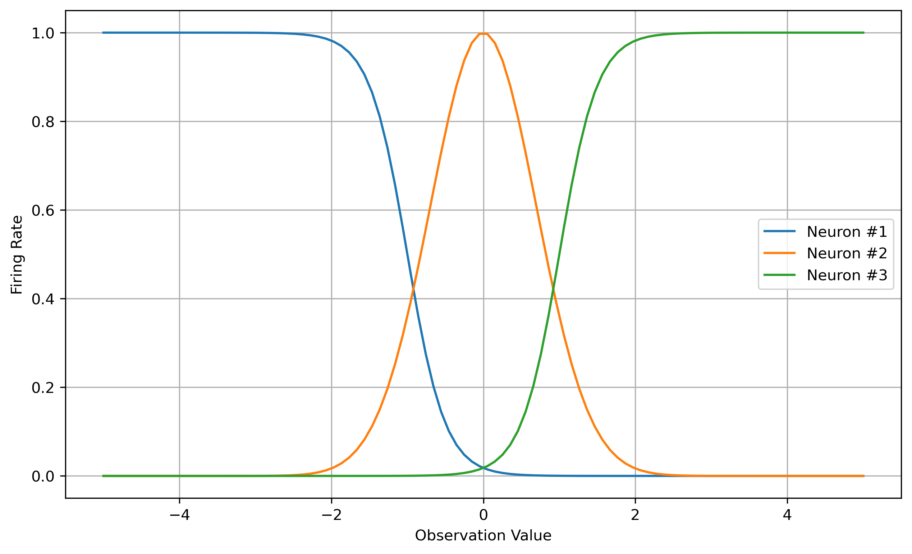
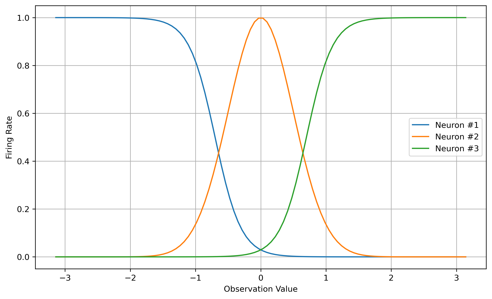

# A Containerization of the Neuroevolution of Artificial General Intelligence (NAGI) Framework
AI Enabled Systems 705.603.82 Fall 2022

Douglas Ogata

## Abstract
The Neuroevolution of Artificial General Intelligence (NAGI) Framework aims to formulate an emergence of Artificial General Intelligence (AGI) in its simplest form. This project leverages the implementation of Open AI Gym's CartPole environment and extends it to the LunarLander environment. Due to computational resource requirements, the results show a need to further evolve the model over multiple generations. The containerization of this framework will enable extended simulations and selection of sufficiently high performing agents.

## 1. Introduction
Artificial General Intelligence (AGI) has been lagging when compared with models that have targeted objectives. In this document, these models will be referred to as "Narrow AI". AGI involves many disciplines across multiple domains covering four basic fields: reasoning, behavior, rationality, and acting. The lack of generalization has been prominent in various tasks such as chat bots and self-driving vehicles, which tend to require context in order to improve against bias and performance in odd scenarios. Despite the amount of data and number of parameters provided for the models, almost all Narrow AI models are restricted to a particular domain.

The Cognitive Architecture of the human brain remains a template to emulate machine intelligence. One of the main hurdle of emulating human intelligence is the dependence on significant progress in the fields such as Neuroscience and Psychology. The key aspects for human cognitive process are:
- Sensory: Human senses enable information input from the physical environment. However, not all information from sensory inputs are captured and registered for processing. The cognitive capability of selective attention becomes a filter to all sensory inputs.
- Storage: Information is stored in a compact manner. Each sensory organ consists of parameters that define its reaction. These parameters can be categorized as: measured parameters, scaling parameters, and grammar parameters.
- Processing: The human brain operates on a network of neurons, and it ingests the sensory data to formulate decisions.
- Precision vs. Approximation: The tradeoff between precision and approximation occur after perceived data has been gathered. Salient parameters such as measured, scaling, and grammar parameters are extracted and assess the similarity to a knowledge base. This makes a general intelligence model more flexible.

Given the various aspects needing to include, the pursuit of AGI remains one of the visions of Artificial Intelligence. Existing AI system based on the Narrow AI framework may lack the capability to generalize, which may cause deficiencies in responding to a dynamic environment. These deficiencies may then lead to inefficient handling of dynamically changing scenarios.

This document proceeds with Section 2 that provides a background of the Neuroevolution of Artificial General Intelligence (NAGI) Framework in the context of AGI. Section 3 then summarizes the LunarLander environment where agents based on the NAGI framework interacts with. Section 4 describes the implementation of the NAGI framework with the LunarLAnder environment, and Section 5 then presents the results of the validation case. The document ends with Section 6 on the discussion of future improvements.

## 2. The Neuroevolution of Artificial General Intelligence (NAGI) Framework
The search of Artificial General Intelligence (AGI) can start from a much lower level than human-level intelligences. Intelligent behavior in nature arises from an organism interacting with its surrounding environment. A changing environment then exerts pressure on the organism to learn new behaviors and adapt to new environments. The objective of this project is to deploy a neuroevolution framework for AGI. This framework touches similar objectives as reinforcement learning but is more aligned with the self-supervised learning.

Unlike Reinforcement Learning (RL), no external supervision is provided. The input is used to adjust the controller of the model through some sensory response. The type of self-supervised learning implemented in this project is called embodied learning, where an agent interacts with an environment through its senses.

The motivation for a self-evolving learning algorithm aims to replicate a smaller level of abstraction based on a set of general and self-adapting properties found in biology. In the search for a simple form of AGI, a framework designed with three key points of biological inspiration:
1. the structure of interconnected processing units that mimics the brain,
2. the evolutionary process, and
3. the sensory interaction with the environment that enables learning.

These inspirations are then translated into a learning model:
1. Biologically plausible neuron models (Spiking Neurons);
2. Evolution of neural network structures (Neuroevolution);
3. Simulated agent-environment interaction promoting self-learning through embodiment.
Evolution is an extremely complex process on a micro scale level, but it is driven by two simple concepts: survival and reproduction.

NeuroEvolution of Augmenting Topologies (NEAT) is a Topology and Weight Evolving Artificial Neural Network (TWEANN) neuroevolution algorithm. NEAT features three different mutation operators: mutating weight values, adding connections and adding nodes. The algorithm also implements features speciation and fitness sharing.

The Neuroevolution of Artificial General Intelligence (NAGI) is a modification of the NEAT algorithm. The NAGI modification implemets Evolution Algorithm (EA) to Spiking Neural Networks (SNNs) to evolve agents that are able to learn throughout their lifetime by interacting with environments that are constantly changing.

Neuroevolution implementation can be categorized into three broad categories: connection weights, network topology, and learning rules. The NAGI framework evolves the learning rules, which can be related to "learning how to learn".

### Framework Concept
The learning paradigm is a self-supervised learning through embodiment, which is inspired from how biological organisms learn. This is done by simulating an agent interacting with an environment that is constantly changing. This approach is envisioned to be in the direction of the emergence of simple models that have general, and problem independent learning capabilities. These simple models are then able to adapt to  changes in their environment without any external supervision.

The basic flow if the framework is such that an agent is composed of an SNN as the controller, sensors as inputs to the controller, actuators that control the agent's actions, and the internal states. The SNN topologies are then evolved according to the EA starting from a minimalist structure which gets increasingly more complex per generation. The agent is placed in a constantly changing environment where the rules of interactions are fluid. The fluidity of an environment enables the agents to generalize and solve problems for multiple environments. This approach differs from widely studied RL approaches where the environments remain static. The agents interact with the environment through sensory inputs. In response, the environment provides rewards and penalties. As the model evolves, the fitness of each agent is measured by how long they survived in an environment. Hence, the main objective for each agent is to survive.


An agent's action depends on its actuators, which track the number of output spikes that occurred within a time window. The current action of the agent is determined by the actuator with the highest spike count. In the case of tied spike counts between actuators, the action will be chosen from the actuator that previously had the highest spike count.

The network architecture evolves according to EA. The fundamental neuron characteristics are that each SNN has a fixed number of input nodes and output neurons, and an arbitrary number of hidden neurons. Hidden neurons can be both excitatory or inhibitory, while output neurons are always excitatory. 

The NAGI framework employs a simplified integrate and fire neuron model, homeostasis, and Spike Time Dependent Plasticity (STDP).
- **Simplified Integrate and Fire Neuron Model**: A neuron’s membrane potential increases directly by its inputs and decays over time by a prescribed factor. A spike is released if the membrane potential exceeds the membrane threshold potential. Subsequently after the spike release, the membrane potential returns to the resting membrane potential.
- **Homeostasis**: This process maintains homogeneity in the neural networks such that all neurons have approximately equal firing rates. The membrane threshold is adjusted during training such that an very active neuron has a higher membrane potential than a more inactive neuron. The effect of this is that a neuron with weak input weights will receive a higher firing rate.
- **Spike Time Dependent Plasticity (STDP)**: This procedure adjusts weights of the connections between neurons according to one of the four Hebbian learning rules. This is implemented by tracking the time elapsed since each input spike within a time duration.

### Evolutionary Algorithm (EA)
An evolutionary algorithm (EA) is a meta-heuristic optimization algorithm that has been inspried by biological evolution. An EA relies on evolving a population of candidates in order to improve the overall fitness of each generation. A fintess function is a reflection of the performance of the candidate against the environment. The objective is then to search for superior solutions with high fitness scores, which correspond to an increase in the inverall performance of the solution.

The general scheme of an EA starts with an initial population that are typically randomly selected. The initial population of candidates or the first generation are then allowed to interact with the environment where a fitness score is determined per each candidate. The parents are selected from the candidates that have the highest fitness scores. The parents are then recombined to generate the next generation of candidates. This step is analogous to mating between individuals in a biological population. During the recombination process, mutation is added to provide small variations in the next generation candidates. After the offsprings have been generated, the performance of this next generation is evaluated against the environment. These procedures are repeated iteratively until a candidate with sufficiently high fitness is selected.

## 3. LunarLander Environment
The benchmark tasks for NAGI evaluate the agent’s ability to generalize and self-adapt. This means that benchmark consists of environments that change during the lifetime of the agent. The test environment in this project is the LunarLander control task in the OpenAI Gym environment. The LunarLander control task is one of the classic control task used as a benchmark in reinforcement learning. In this environment, the task is to control engine throttle of a lander to the landing pad that is constrained in two-dimensions (horizontal and vertical). The simulation terminates if the lander crashes or comes to rest. Reward points are provided in either situation. OpenAI Gym is an open source Python library for developing and comparing reinforcement learning algorithms by providing a standard API to communicate between learning algorithms and environments.

The state space for the LunarLander environment (OpenAI Gym, 2016) is composed of seven attributes. Six attributes are continuous numbers while two are binary. The two binary values are for the leg contacts such that no contact is 0 while contact is 1. These attributes are important to note since they directly impact the implementation of the firing rates of the neurons.

| Num | Observation | Min | Max |
|---|---|---|---|
| 0 | Horizontal Coordinate | -1.5 | 1.5 |
| 1 | Vertical Coordinate | -1.5 | 1.5 |
| 2 | Horizontal Speed | -5.0 | 5.0 |
| 3 | Vertical Speed | -5.0 | 5.0 |
| 4 | Angle | $-\pi$ | $\pi$ |
| 5 | Angular Speed | -5.0 | 5.0 |
| 6 | First Leg Contact | 0 | 1 |
| 7 | Second Leg Contact | 0 | 1|

The action space of the LunarLander environment is composed of two continuous actions correspoonding to the throttle of the engines.

| Num | Action | Min | Max |
|---|---|---|---|
| 0 | Main Engine | 0.0 | 1.0 |
| 1 | Lateral Engine | -1.0 | 1.0 |

The main engine throttle scales between 50% to 100% from `0 <= main <= 1`. The main engine is turned off for any negative values. The lateral engines are turned on if the values are `lateral > 0.5` for the right engine and `lateral < -0.5`. Similar to the main engine throttle scaling, the lateral engine throttle scales between 50% to 100% power.

Rewards are determined per each frame in the LunarLander simulation. The typical reward for moving from the top of the screen to the landing pad and coming to rest is about 100-140 points. Reward is lost if the lander moves away from the landing pad. A crash deducts -100 points. A lander that comes to rest receives an additional +100 points. Each leg with ground contact is +10 points. Firing the main engine is -0.3 points per each frame, and firing the lateral engine is -0.03 points each frame. The maximum possible points is 200 points.

## 4. Model Implementation
This section discusses the implementation of the LunarLander environment in the context of the NAGI framework. The number of agents is defined by the number of available cores. Only two generations are evolved due to limited computational resources, and the highest performing agent from the EA is then selected for a validation simulation.

### Neuron spike threshold selection
The input signals of a spiking neural network is a sequence of binary time series over a time interval or a spike train. This is done to replicate how an agent sense and acts in an environment. The flow of spikes over time can be interpreted as firing rate, which correspond to a frequency or the number of spikes per second. From these firing rates, spike trains are generated as as input or stimulus to the neural network. This firing rate then needs to be translated into inputs and outputs for the SNN.

Similar to the implementation of the CartPole scenario, the LunarLander observation values must be mapped to the firing rates. Following from the work presented by Pontes-Filho, et al. (2022), three neurons are used to map to real numbers. This is because the firing rate of a single neuron can be difficult to deal with in an adaptive spiking neural network. Sigmoid functions are used for Neurons #1 and #3 while a normalized Gaussian function is used for Neuron #2. The firing rates were arbitrary selected based on the approach provided in Pontes-Filho, et al. (2022).

The parameters for the position firing rate are:
| Neuron | Function | Parameters |
|---|---|---|
| #1 | Sigmoid | $w = -7, z = -0.3$ |
| #2 | Gaussian | $\mu = 0.0, \sigma = 0.2$ |
| #3 | Sigmoid | $w = 7, z = 0.3$ |


The parameters for the velocity firing rate are:
| Neuron | Function | Parameters |
|---|---|---|
| #1 | Sigmoid | $w = -4, z = -1$ |
| #2 | Gaussian | $\mu = 0.0, \sigma = 0.7$ |
| #3 | Sigmoid | $w = 4, z = 1$ |



The parameters for the velocity firing rate are:
| Neuron | Function | Parameters |
|---|---|---|
| #1 | Sigmoid | $w = -5, z = -0.7$ |
| #2 | Gaussian | $\mu = 0.0, \sigma = 0.5$ |
| #3 | Sigmoid | $w = 5, z = 0.7$ |



For the firing rate representation of the leg contacts, this is viewed as a binary classification task. A minimum and maximum firing rate is required to convert into a binary `0` or `1`. Following the implementation of Pontes-Filho, et al. (2022), two output neurons are used to represent one binary value in order to avoid specifying a predefined threshold. As a reult, this is a one-hot encoding scheme for the frequency inputs.
| Binary | Firing Rate |
|---|---|
| 0 | (low, high) |
| 1 | (high, low) |

### Fitness definition
A fitness score is determined per each generation of agents. The fitness score is the reward points an agent receives in the LunarLander simulation. The fitness score is calculated by the mean of the maximum normalized reward per each agent. An agent iterates through the frames in the LunarLander environment, and a maximum reward is tracked for each instantiation. The maximum reward is normalized by the maximum points for a LunarLander simulation, which is 200 points. The fitness score for each generation is the mean of the maximum normalized rewards.

### Environmental configurations
Pontes-Filho, et al. (2022) provided a framework to evolve the model in a CartPole environment such that both the length of the pole varies as well as the pole configuraton becomes inverted. The same framework is adapted for the LunarLander scenario; however, only the gravity is varied. Other environment configurations such as wind and turbulence will be left to future investigations.
| Scenario | Environment | Gravity |
|---|---|---|
| Train | LOW | -1.0 |
| Train | MID | -5.0 |
| Train | HIGH | -10.0 |
| Validate | MOON | -1.625 |
| Validate | MARS | -3.72 |

During the training session, the agent evolves according to the EA while the gravity changes from LOW to MID and then to HIGH. The gravity also changes during the validation phase from MOON to MARS.

## 5. Evolving the Model
In order to run the implementation, cloning the repository provides the modifed code base.
```
git clone https://github.com/dogata/neat-nagi-python-clone.git
```
The code base origin can be found at the the [NEAT NAGI repository](https://github.com/SocratesNFR/neat-nagi-python). The CartPole setup was modified to implement the LunarLander scenario. The following additional files were added:
- `scripts\run_neat_lunarlander_gym.py`
- `scripts\extract_genome_lunarlander_gym.py`
- `scripts\simulation_lunarlander_gym.py`
- `nagi\utils.py`
The following limitations were imposed during the modification:
- File paths were hardcoded to transfer data from one stage to another.
- In the genome extraction stage, the only measure used is the fitness and the first index is used.

The Dockerfile in the repository provides the defition to build the Docker image.
```
docker buildx build --platform linux/amd64 -t dogata/705.603_douglasogata:12_project  --push .
```
Minimal set of requirements were included for the container. This means that Jupyter Notebook was not included for the current release. The Docker image can be accessed via
```
docker pull dogata/705.603_douglasogata:12_project
```

### Setting up run path
The environment path variable can be defined in various ways. For instance, two possible ways are
1. Execute at container command line:
`export PYTHONPATH="/path/to/neat-nagi-python":$PYTHONPATH`
2. Initialize the container by passing in the environment argument. An example of this is shown in `docker_run.sh`.

### Evolving the model and run test case
Navigate into the `scripts` directory. Run the NEAT algorithm. After finished, extract the genome from the generated pickle file inside `data` directory. The extracted genome can be simulated with `simulation_*.py`.

```
cd scripts
python run_neat_lunarlander_gym.py
python extract_genome_lunarlander_gym.py
python simulation_lunarlander_gym.py
```

Examples of the simulation runs are provided as Jupyter notebooks located in the `notebooks` directory.

## 6. Results
The vision of the NAGI framework is to lead research a step in the direction for the emergence of AGI in its simplest form. The framework combines the concepts from AI, evolutionary robotics and artificial life. The main concept behind the framework stems from the long-lasting natural evolution of general intelligence found in biological organisms.

After the training process with EA, the highest performing agent is selected for a validation simulation. Each agent is evaluated only by its fitness score. With only two generations, the highest performing agent is expected to perform poorly. The overall fitness score is $\sim 0.01$ for two generations. Initial results provide a proof of concept but lack proper genrational fitness and sufficient tuning of the NAGI framework for the LunarLander environment. The following plots show the evolution of the membrane potentials, weights, and action space history.

### Membrane Potentials
The membrane potentials show the activity of the two output neurons for both the lateral engine and the main engine. The membrane potential is represented as a green line, and the membrane threshold is the blue line. The output neuron becomes active or fires when time the blue line’s value increases.  The flip point denotes the point at which the environment changes. In this project, only gravity is being varied.

The results show activities in both throttles for the lateral and main engines. However, the value may not be sufficient to continuously activate both the engines, which is shown in the Engine History figure.


### Weights
The weights figure show the value of the weight of each connection in the agent’s SNN during simulation.


### Actuator History
The following figure shows the actions taken by the agents during the simulation. The green line represents the lateral engine throttle while the blue line presents the main engine throttle. Due to the limited number of generations, there are minimal activities in both engines.


## 7. Improvements
Due to the computational resource requirement to evolve the SNNs, a limited execution was performed for this project. The containerization of this framework enables the extension to scalable cloud computational platforms, which can provide an expanded multi-generational evolutions in order to determine the highest performing agent. Potential further investigation includes:
- Extend the model evolution to more generations.
- Review the SNN implementation and check for proper mapping between firing rates to observation state.

With the contenerization of the NAGI framework, comparisons with frequently used Reinforcement Learning algorithms will also provide insight to the performance of a simple AGI framework against task-specific Reinforcement Learning agents.

## 8. References
- V. K. Nyalapelli, M. Gandhi, S. Bhargava, R. Dhanare and S. Bothe. "Review of progress in Artificial General Intelligence and Human Brain inspired Cognitive Architecture." 2021 International Conference on Computer Communication and Informatics (ICCCI) pp. 1-13 (2021). [doi: 10.1109/ICCCI50826.2021.9402446](https://ieeexplore.ieee.org/document/9402446)
- Stuart Russell and Peter Norvig, *Artificial Intelligence: A Modern Approach*. 4th ed. Pearson (2021).
- Sidney Pontes-Filho, Kristoffer Olsen, Anis Yazidi, Michael A. Riegler, Pål Halvorsen and Stefano Nichele. "Towards the Neuroevolution of Low-level Artificial General Intelligence." [arXiv:2207.13583](https://arxiv.org/abs/2207.13583) (2022).
- Kristoffer Olsen. "Neuroevolution of Artificial General Intelligence." [Master thesis](http://heim.ifi.uio.no/~paalh/students/KristofferOlsen-master.pdf), University of Oslo (2020).
- Greg Brockman, Vicki Cheung, Ludwig Pettersson, Jonas Schneider, John Schulman, Jie Tang and Wojciech Zaremba. "OpenAI Gym." [arXiv:1606.01540](https://arxiv.org/pdf/1606.01540) (2016).
- Thomas Titcombe. OpenAI Gym Docker Image. [GitHub repository](https://github.com/TTitcombe/docker_openai_gym) (2019).